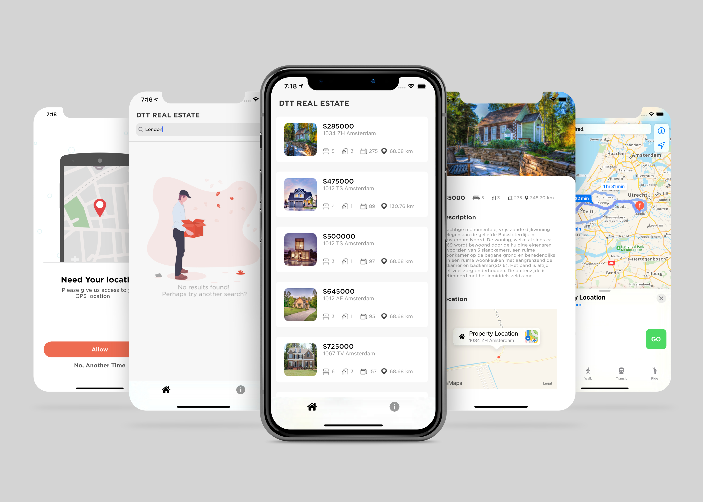

<!-- PROJECT LOGO -->
 

   
  <h2 align="center">HotHouses</h2>

HotHouse is an app that will help you find your next home. Browse houses/flats for sale and to rent in your area and get directions to the property location.

 

### Technologies Used

`Swift 5`  `Moya`  `CoreLocation`  `MapKit`  `Kingfisher`  `SwiftSpinner`

### Architecture Used

`MVVM`
